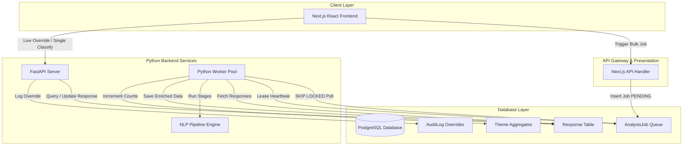
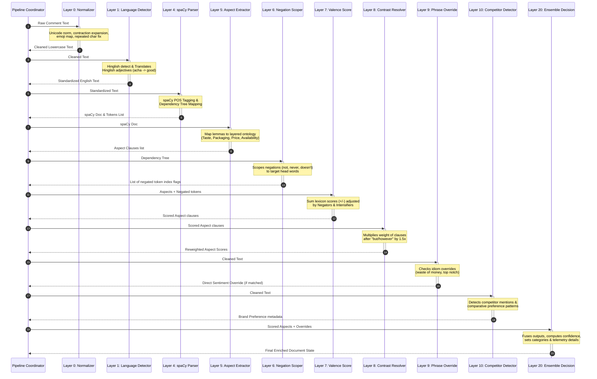
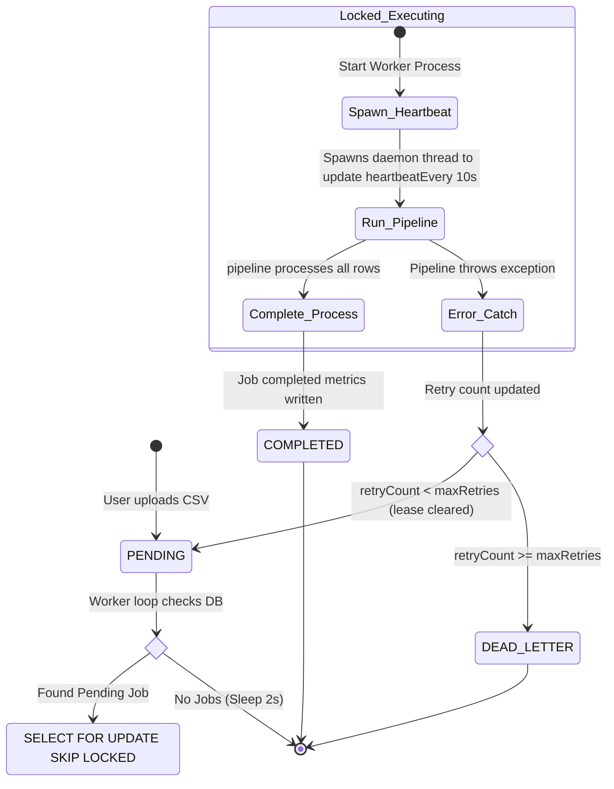

# SurveyIQ Offline NLP Engine Architecture

This document outlines the detailed system and pipeline architectures of the SurveyIQ fully-offline NLP engine.

---

## 1. High-Level Component Interactions

This system decouples the Next.js presentation server from the heavy NLP computation worker using a PostgreSQL row-locked job queue.

---

## 2. NLP Pipeline Parsing Flow (Layer 0 to Layer 20)

Every survey response undergoes a 15-stage pipeline processing path. The output of each layer feeds directly into subsequent modules.

---

## 3. Concurrency Polling & Heartbeat Lease Locks

To prevent race conditions across parallel python instances running the worker daemon, jobs are leased using database-level locking and self-renewing timers.

